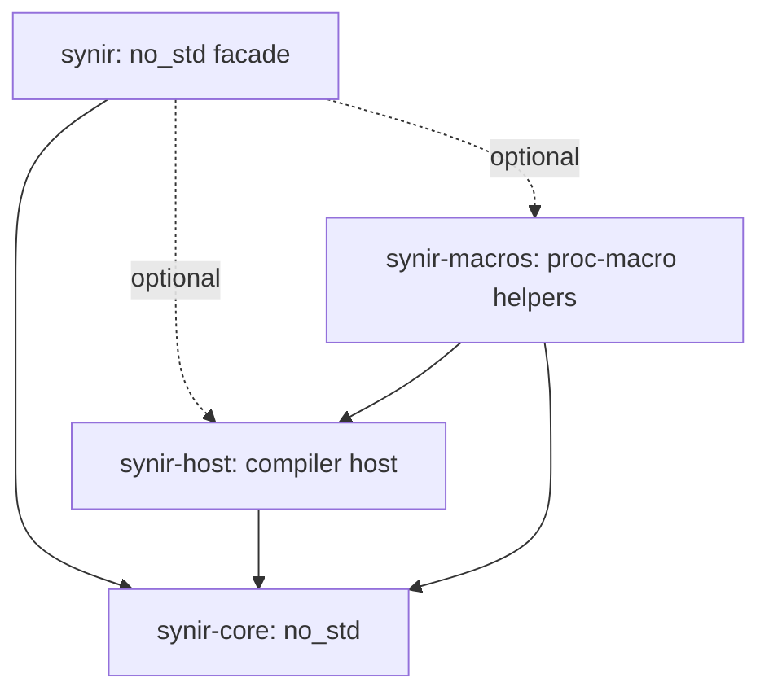

# Synir implementation plan

Status: accepted setup direction; syntax implementation has not begun.
Authority: [IDEA.md](IDEA.md), including its final capability-over-API clarification.
The numbered [release plan](RELEASE_PLAN.md) replaces the idea's compressed
version ranges. Each release has one reviewable purpose and a pentest exit.

## Product contract

Build a unified toolkit for Rust macro authors and source-tool authors with
zero third-party Cargo dependencies. Support the practical capabilities of
parsing, native token handling, attributes, quotation, full grammar, traversal,
and transformation with a new API. No source/API compatibility layer is planned.
A lexer is not a type checker; syntactic `Secret<T>` does not resolve a semantic type.
No certification, vulnerability-free, fixed total size, or performance claims
are justified by the setup. Benchmark complete equivalent workflows later.

## Architecture

The main crate is `synir`; the mention of a main `brynja` crate in the setup
request is treated as the reference architecture. This repository does not edit
Brynja. Brynja can later consume Synir through the public facade.

Keep the initial four package boundaries from the idea. Split implementation
into focused modules for tokens, storage, budgets, lexing, Unicode, grammars,
views, schemas, emitters, owned syntax and edits. No source file may exceed 500
lines, including generated code and tests. Shard generated Unicode data.
Extract an additional first-party crate only when a real ownership or portability
boundary warrants it; small modules do not each require a published package.

`tools/xtask` is an unpublished Rust/std binary with no dependencies. Runtime
libraries, test fixtures and maintainer workspaces all retain the no-third-party
rule. External executables can supply compiler/fuzz/differential evidence;
do not introduce Syn, libFuzzer, trybuild or a property library as dev dependencies.
Use deterministic first-party generators and `std::process` fixture runners.

## Profiles and boundaries

| Profile | Planned environment | Contract |
| --- | --- | --- |
| Base | no_std, no allocator | Caller storage, bounded tokens/cursors/errors |
| alloc | no_std + alloc | Fallible budgeted owned storage |
| derive / attributes / emit | Portable core | Validated declaration-to-plan pipeline |
| proc-macro | Compiler host | Invocation-local native handles and spans |
| quote / macro-dev | Optional compiler helper | Ergonomic generated builder calls |
| source | Portable core | Borrowed source, trivia and versioned lexer |
| full | Optional core grammar | Full supported Rust syntax, no resolution |
| source-edit | Optional owned storage | Revision-bound checked lossless edits |

Only `alloc`, `proc-macro` and `quote` dependency wiring exists at setup; their
algorithms do not. Add the other feature names only with implemented behavior.
Features must be additive: enabling allocation or full grammar cannot make an
existing strict operation recover silently or change its backend concrete type.

## Required design invariants

1. Distinct header inspection, validated derive/type/attribute/impl plans,
   recovered syntax, and explicitly opaque token regions.
2. Input-bound private IDs/ranges; checked constructors reject foreign storage.
3. Parse-all consumes everything; parse-prefix and recovery are explicit.
4. Every field/variant is validated even if the caller stops iterating early.
5. Work is charged before actions; rollback never refunds work. Input bytes,
   tokens, depth, nodes, decoded bytes, storage, output and diagnostics are bounded.
6. Native import preserves handles, joint punctuation and group spans. Do not
   stringify and reparse streams, fabricate hygiene, or serialize native handles.
7. Source, token and provenance fidelity are separate guarantees. Preserve
   invisible groups; test compiler precedence, not only textual output.
8. Schemas reject unknown owned keys, duplicates, wrong types and conflicts;
   unrelated namespaces are forwarded. Strings are decoded, not quote-stripped.
9. Generic declaration, impl and argument projections are distinct; no accidental
   defaults in impls or unnecessary type bounds. Parse where clauses by grammar.
10. Output is fallible and transactional; data becomes literals, code insertion
    requires explicit parsing; failures render bounded errors, never empty success.
11. Native/compiler allocation and arbitrary callbacks are outside cooperative
    quotas. External process limits complement internal counters.
12. Lexer grammar, Unicode/NFC, adapter support and library API are separate
    version axes. Commit reproducibly generated official data with its license.

## Implementation sequence

Deliver foundation and deterministic adversarial fixtures first, then native
token import and grammar-aware declaration boundaries. Literal/schema behavior
precedes generated behavior controlled by attributes. Manual emission and a
real Describe acceptance project precede quotation. Source/Unicode, expanded
declarations, expressions/patterns/items, traversal and source edits follow in
separate passes. Full capability acceptance precedes 1.0; the focused macro
profile is usable in pre-1.0 milestones without waiting for full-source tooling.

Each pass starts with a scope manifest naming APIs, inputs/outputs/errors,
exclusions, numeric budgets, crate ownership and test command. Consult current
official Rust/compiler sources before implementing unfamiliar grammar/APIs.
All negative/error paths and boundary values must be testable. Never implement
a late dependency through a stub and then advertise its consumer as complete.

## Definition of done for a pass

Code, tests, docs, examples and release notes agree on scope. Run local checks,
compiler and applicable platform/feature matrices; record corpus and source
revisions. Gather parser-specific hostile-input, differential and resource
measurements from the first algorithmic releases onward. Stop at an exact
candidate for pentest; remediate and repeat affected verification. Only linked
evidence can promote a capability from planned to implemented or independently
reviewed. Publication and tagging follow [the runbook](RELEASE_RUNBOOK.md).
